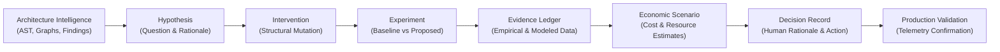
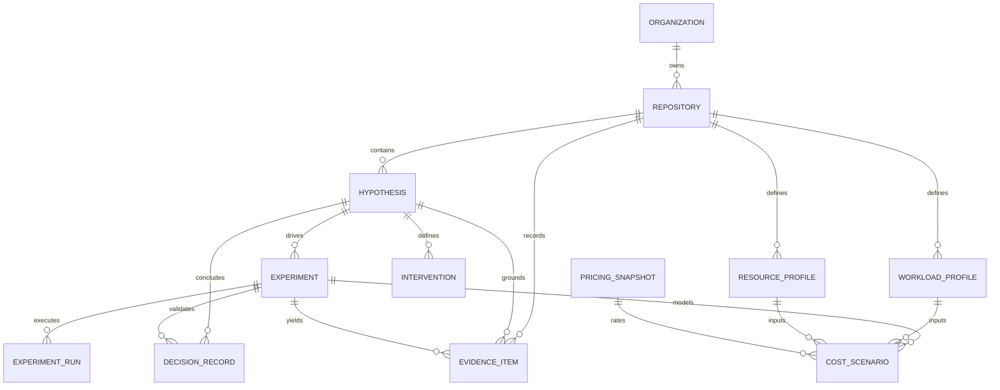

# Architecture Lab & Architectural Economics Intelligence (AEI) Domain Architecture

## 1. Executive Summary & Purpose

The **Architecture Lab** is Coodara's systematic environment for **Architectural Economics Intelligence (AEI)**. It empowers engineering leaders, architects, and product teams to reason about structural software changes not as subjective debates, but as disciplined, empirical, hypothesis-driven architectural interventions backed by verifiable evidence and modeled economic projections.

In conventional development workflows, refactorings and architectural migrations are often postponed or misjudged because their infrastructure cost impact and operational consequences cannot be accurately forecasted prior to execution. Coodara AEI bridges static code analysis with economic and operational realities.

---

## 2. Core Lifecycle

The Architecture Lab follows a strict causal lifecycle:

1. **Architecture Intelligence Grounding**: Every inquiry begins with canonical code health, component dependency graphs, or hotspot findings produced during repository analysis.
2. **Hypothesis Formation**: An engineer poses a falsifiable architectural question (e.g., *"Does decoupling module X into an asynchronous queue reduce p99 latency without increasing compute expenditure?"*).
3. **Intervention Specification**: One or more concrete architectural interventions are declared (e.g., `SPLIT`, `MERGE`, `MOVE`, `REMOVE`, `BREAKING_REFACTOR`, `COMPATIBLE_REFACTOR`).
4. **Experimentation**: An experiment compares the current baseline reference (commit SHA or snapshot) against the proposed intervention variant.
5. **Evidence Collection**: Evidence is recorded into an append-only, durable evidence ledger with rigorous provenance and category classification.
6. **Economic Scenario Modeling**: Workload profiles and resource sizing profiles are combined with reference pricing snapshots to compute modeled economic scenarios.
7. **Human Engineering Decision**: Engineers record an explicit decision (`ACCEPT`, `REJECT`, `DEFER`, `NEEDS_VALIDATION`) citing supporting evidence IDs.
8. **Production Validation**: Once deployed, real telemetry confirms or refutes the modeled projections.

---

## 3. Entity Relationships & Domain Schema

### 3.1 Entity Catalog

| Entity | Table Name | Purpose | Key Attributes |
| :--- | :--- | :--- | :--- |
| **Hypothesis** | `lab_hypotheses` | Falsifiable architectural assertion | `title`, `question`, `status` (`DRAFT`, `READY`, `RUNNING`, `COMPLETED`, `CANCELLED`) |
| **Intervention** | `lab_interventions` | Proposed structural change | `intervention_type` (`REMOVE`, `SPLIT`, `MERGE`, etc.), `target_component_ids`, `parameters` |
| **Experiment** | `lab_experiments` | Comparative evaluation setup | `baseline_reference`, `proposed_reference`, `status` |
| **ExperimentRun** | `lab_experiment_runs` | Execution instance of an experiment | `run_number`, `status` (`PENDING`, `RUNNING`, `COMPLETED`, `FAILED`, `CANCELLED`), timestamps |
| **WorkloadProfile** | `lab_workload_profiles` | Workload attributes (RPS, volume, data) | `requests_per_second`, `is_measured` (distinguishes telemetry vs synthetic assumptions) |
| **ResourceProfile** | `lab_resource_profiles` | Infrastructure sizing (vCPU, RAM, replicas) | `provider`, `region`, `cpu`, `memory`, `database_class`, `replicas` |
| **PricingSnapshot** | `lab_pricing_snapshots` | Cloud/infra rate card snapshot | `provider`, `region`, `currency`, `pricing_data`, `captured_at` |
| **EvidenceItem** | `lab_evidence_ledger` | Append-only audit record of claims | `category`, `source_type`, `subject`, `claim`, `confidence`, `provenance` |
| **CostScenario** | `lab_cost_scenarios` | Modeled economic projection | `assumptions`, `estimated_cost_outputs`, `calculation_metadata` |
| **DecisionRecord** | `lab_decision_records` | Architecture Decision Record (ADR) | `decision` (`ACCEPT`, `REJECT`, `DEFER`, `NEEDS_VALIDATION`), `rationale`, `supporting_evidence_ids` |

---

## 4. Evidence Classification & Taxonomy

To maintain high architectural integrity, all evidence recorded in the `lab_evidence_ledger` must belong to one of five explicit categories:

1. **`STATIC`**: Grounded purely in static AST analysis, static dependency graphs, structural coupling, cyclomatic complexity, or architectural smell rules.
2. **`OBSERVED`**: Derived from external observations, distributed tracing topologies, commit history patterns, or repository metadata without active runtime execution.
3. **`MEASURED`**: Empirically measured via active benchmarks, synthetic load harnesses, profiling runs, or staging smoke tests.
4. **`MODELED`**: Synthesized by analytical models (e.g., graph impact radius propagation, queueing models, heuristic blast-radius estimation).
5. **`PROJECTED`**: Forward-looking economic forecasts or operational scaling extrapolations.

### Strict Economic Modeling Principle

> [!IMPORTANT]
> **Modeled/Projected Economic Projections $\neq$ Actual Production Outcomes**
>
> In Coodara AEI, outputs in `CostScenario` are explicitly designated as **modeled scenarios** or **projected deltas**.
> System components, APIs, reports, and UI must **NEVER** claim modeled estimates as "actual savings" or guaranteed financial returns. Actual operational savings can only be verified post-decision via measured telemetry from production.

---

## 5. Tenancy Isolation & Security Boundaries

The Architecture Lab enforces strict multi-tenant boundaries:

1. **URL Scoping**: All API routes are strictly scoped under:
   `/api/v1/organizations/{organization_id}/repositories/{repository_id}/lab`
2. **Membership Guard**: The caller must be an active user authenticated via bearer token or session cookie, and a verified member of the requested `organization_id`.
3. **Ownership Verification**: Every repository operation verifies that `repositories.organization_id == requested_organization_id`. Cross-tenant or mismatched requests immediately reject with `404 Not Found` without leaking repository existence.
4. **Cascading Integrity**: Deletion of an organization or repository cleanly cascades to all associated hypotheses, interventions, experiments, evidence items, and decisions.

---

## 6. Stage Boundaries

- **Stage 2 (Complete)**: Domain data model, persistence layer, Alembic migration, schemas, repository and service layers, API routing, and comprehensive tests.
- **Stage 3 (Future)**: Interactive Architecture Lab UI, hypothesis builder, intervention composer, visual evidence comparisons.
- **Stage 4+ (Future)**: Automated benchmark execution harness, live cloud pricing integrations, automated telemetry reconciliation.
